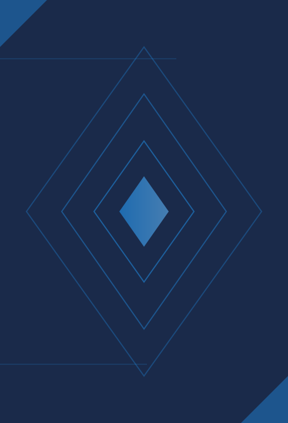
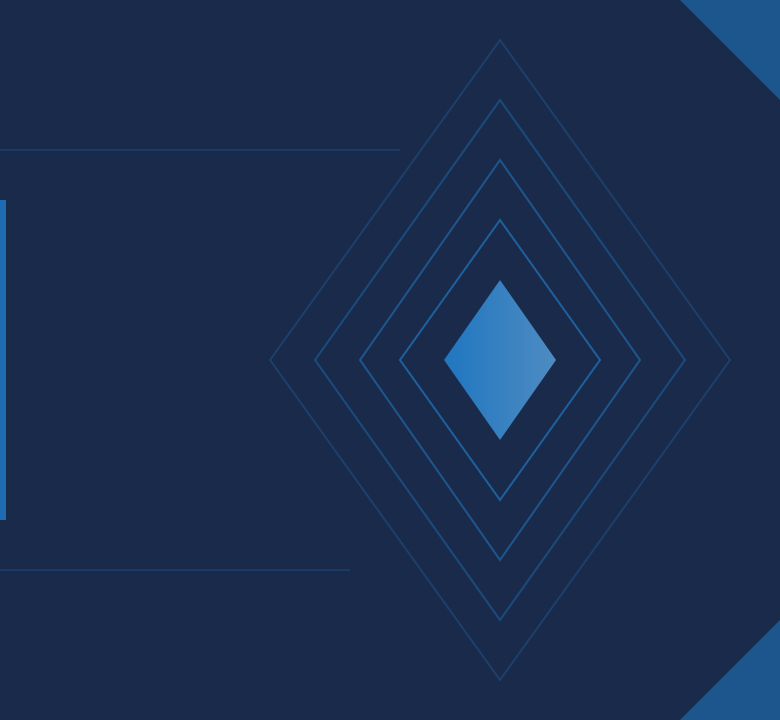
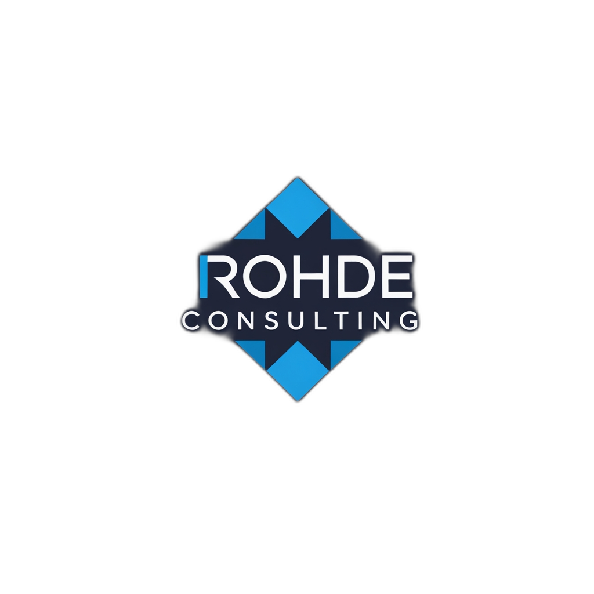
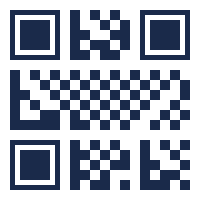
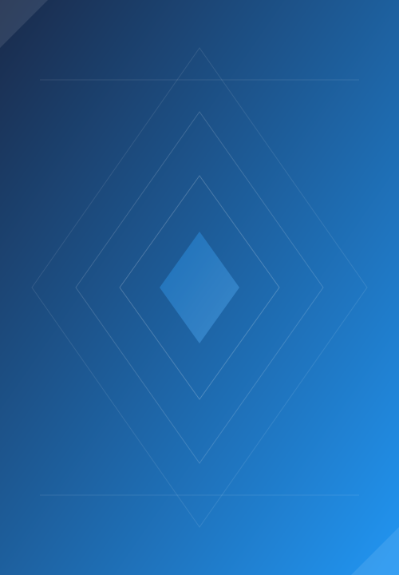

<!-- _class: title -->

# Rohde Consulting
## Software Development & Consulting

---

<!-- _class: agenda -->

# Agenda

1. About Rohde Consulting
2. Our Services
3. Technology Stack
4. Project Approach
5. Contact

---

<!-- _class: chapter -->

# About Us
## Professional Software Development

---

# Company Overview

Rohde Consulting provides **professional software development** and consulting services with a focus on modern technologies and agile methodologies.

#### Mission

- Deliver high-quality solutions
- Enable digital transformation
- Foster innovation
- Build lasting partnerships

#### Values

- Technical excellence
- Transparent communication
- Customer focus
- Continuous improvement

---

<!-- _class: quote -->

# Innovation through **expertise** and dedication to quality

## Moritz Rohde, Founder

---

<!-- _class: chapter-numbered -->

02

# Our Services
## What We Offer

---

# Service Portfolio

#### Development

- Full-stack web development
- Mobile applications
- API design & integration
- Cloud-native solutions

→ Custom software solutions

#### Consulting

- Architecture reviews
- Technology assessments
- Digital strategy
- Process optimization

→ Strategic guidance

#### Training

- Team workshops
- Code reviews
- Best practices
- Technology adoption

→ Knowledge transfer

---

# Key Advantages

What sets us apart from the competition

1

#### Technical Expertise

- Deep knowledge of modern frameworks
- Experience with enterprise systems
- Performance optimization focus

2

#### Agile Approach

- Iterative development cycles
- Continuous feedback integration
- Flexible scope management

---

<!-- _class: chapter-numbered -->

03

# Technology Stack
## Tools & Frameworks

---

# Technology Overview

| Category | Technologies |
|----------|-------------|
| Frontend | Angular, React, TypeScript, HTML5/CSS3 |
| Backend | Java, Spring Boot, Node.js, Python |
| Cloud | AWS, Azure, Google Cloud, Kubernetes |
| Database | PostgreSQL, MongoDB, Redis, Elasticsearch |
| DevOps | Docker, CI/CD, Terraform, GitHub Actions |

---

# Development Statistics

50+

Projects Delivered

10+

Years Experience

100%

Client Satisfaction

---

<!-- _class: steps -->

# Our **Development Process**

1. **01**
▼
Discovery
2. **02**
▼
Design
3. **03**
▼
Develop
4. **_04_**
▼
Test
5. **05**
▼
Deploy

---

<!-- _class: chapter-numbered -->

04

# Project Approach
## How We Work Together

---

# Project Flow

#### Initial Consultation

Understanding your needs and goals

→

#### Delivered Solution

Quality software that drives results

---

# Engagement Models

#### Project-Based

- Fixed scope and timeline
- Clear deliverables
- Milestone-based payments
- Ideal for defined projects

#### Time & Materials

- Flexible scope
- Continuous collaboration
- Monthly billing
- Ideal for evolving needs

---

# Technology Labels

Expertise across multiple domains:

Angular
React
Java
TypeScript
Spring Boot
Docker

---

<!-- _class: rc-contact-layout -->

# Contact

Moritz Rohde

Founder & Software Developer

rohde.development@gmail.com

<a href="https://linkedin.com/in/rohde-moritz" class="linkedin">rohde-moritz</a>

Scan for LinkedIn

**Rohde Consulting**

Munich, Germany

[rohde.development@gmail.com](mailto:rohde.development@gmail.com)

---

<!-- _class: end -->

# Thank You

